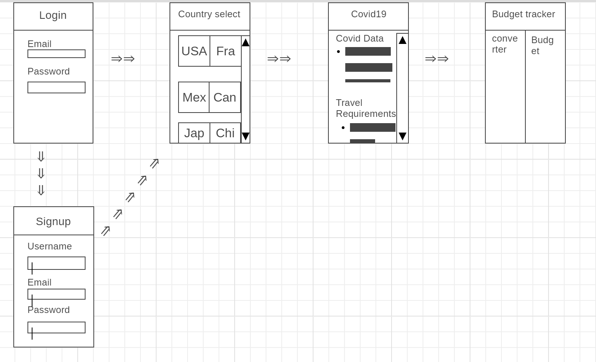

# Project 3

## Table of Contents

[Description](#Description)

[Installation](#Installation)

[Usage](#Usage)

[Licenses](#Licenses)

[Contributors](#Contributors)

[Tests](#Tests)

[Questions](#Questions)

[Links](#Links)

[Screenshots](#Screenshots)

## Description

For this project, we were tasked with creating an application using 

## Installation

- 
- 
- 
- 
- 
- 
- 

## Usage

N/A

## Licenses

N/A

## Contributors

- Jennifer Aguirre
- Kyle Brazier
- Tahmeena Javed
- Matt Rikard

## Tests

N/A

## Questions

You may reach us at jennifermichelle.aguirre@gmail.com, kylebrazier@gmail.com, tahmeenaowais@yahoo.com or matthew.rikard@gmail.com for further questions.

## Links

<!-- https://nameless-brook-84052.herokuapp.com/ -->

## Screenshots

<!-- 
.png)
 -->
