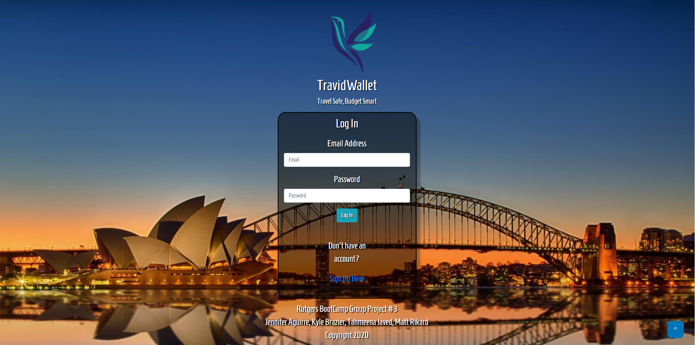
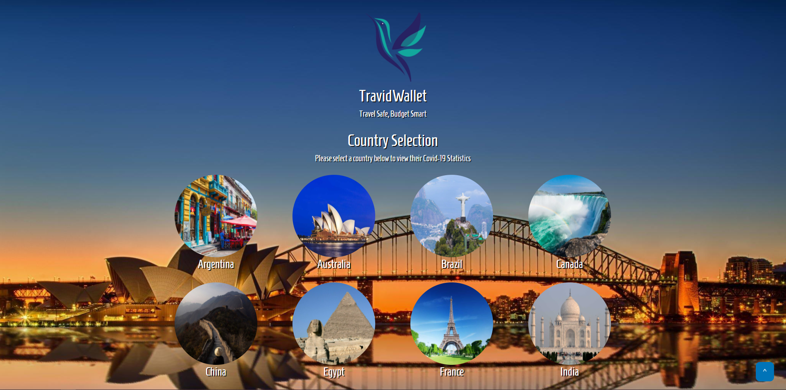
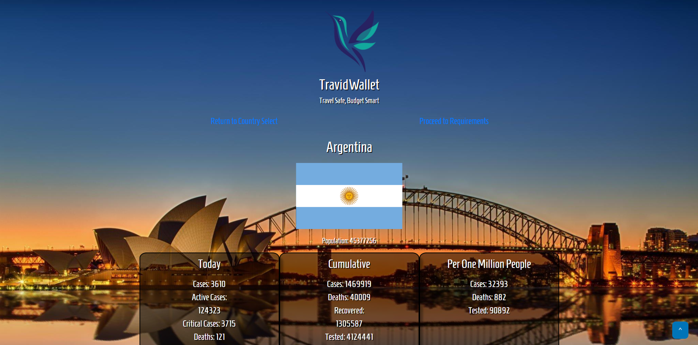

# Project 3

## Table of Contents

[Description](#Description)

[Installation](#Installation)

[Usage](#Usage)

[Licenses](#Licenses)

[Contributors](#Contributors)

[Tests](#Tests)

[Questions](#Questions)

[Links](#Links)

[Screenshots](#Screenshots)

## Description

For our final project, we were tasked with creating an application using techniques learned throughout the course.

## Installation

- Clone Repository
- npm install
- npm run start

## Usage

N/A

## Licenses

N/A

## Contributors

- Jennifer Aguirre
- Kyle Brazier
- Tahmeena Javed
- Matt Rikard

## Tests

N/A

## Questions

If you have any questions or have any bugs to report, please email jennifermichelle.aguirre@gmail.com, kylebrazier@gmail.com, tahmeenaowais@yahoo.com or matthew.rikard@gmail.com.

## Links

https://still-waters-92313.herokuapp.com/

## Screenshots

